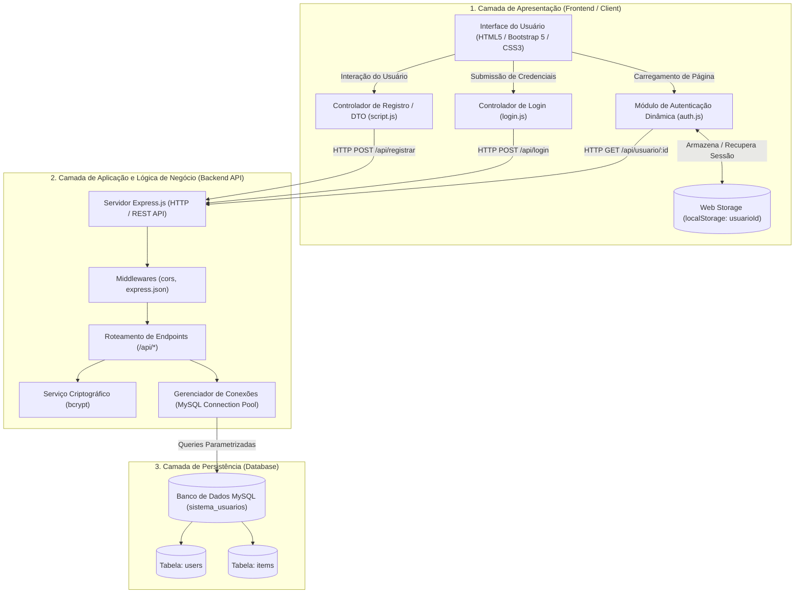
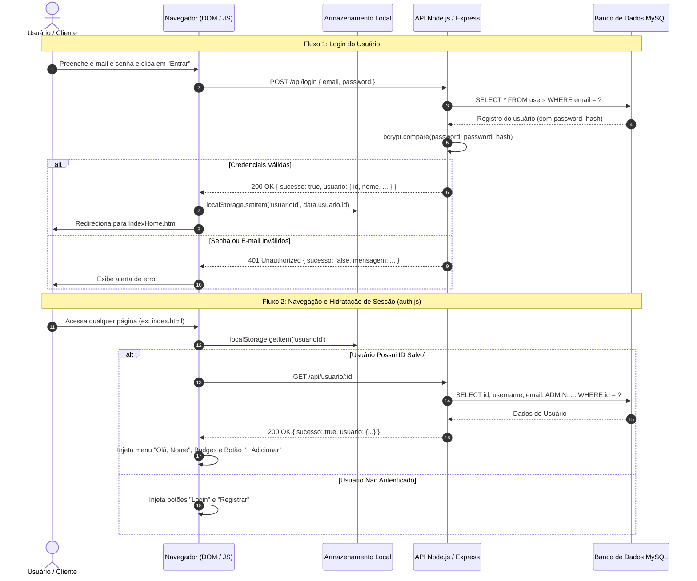
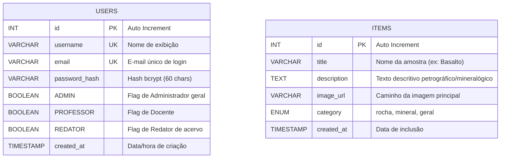

# Documento de Arquitetura de Software (DAS)
## Studio - Acervo Virtual de Geociências (Rochas e Minerais)

**Instituição:** Instituto Federal do Paraná (IFPR) - Campus Cascavel  
**Curso / Contexto:** Trabalho de Conclusão de Curso (TCC)  
**Autor / Desenvolvedor:** Eduardo Kinzo Ishida  
**Orientador / Curador:** Prof. Lineker Nunes  

---

## 1. Visão Geral do Sistema

O **Studio - Acervo Virtual de Geociências** é uma plataforma web educacional e colaborativa criada para catalogar, documentar e expor amostras de rochas (magmáticas, metamórficas e sedimentares) e minerais do laboratório de geociências do IFPR. 

O software foi concebido para atender à comunidade acadêmica (estudantes, professores e pesquisadores), permitindo o estudo visual por meio de fotografias em múltiplos ângulos (carrossel de imagens), contextualização geológica e controle de acesso diferenciado para administração e redação de conteúdo.

---

## 2. Modelo Arquitetural: Arquitetura em Três Camadas (3-Tier)

A arquitetura do sistema adota o padrão **Client-Server** desacoplado, estruturado em **Três Camadas Lógicas (N-Tier Architecture)**:



### 2.1. Camada de Apresentação (Presentation Tier - Frontend)
- **Tecnologias:** HTML5 semântico, CSS3 customizado, Bootstrap 5.3.3, JavaScript moderno (ES6+ Modules, Async/Await, Fetch API).
- **Responsabilidades:**
  - Renderização das interfaces de navegação, catálogos em grade de cards e páginas de detalhes com carrosséis responsivos.
  - Validação de formulários no lado cliente.
  - Injeção dinâmica de componentes de interface com base no estado de autenticação e nível de permissão do usuário (`auth.js`).
  - Armazenamento temporário de identidade de sessão no navegador (`localStorage`).

### 2.2. Camada de Aplicação (Application / Business Logic Tier - Backend)
- **Tecnologias:** Node.js (v20+), Express.js framework, CORS, bcrypt, mysql2/promise.
- **Responsabilidades:**
  - Fornecimento de uma interface de comunicação **RESTful API** sobre HTTP/JSON.
  - Aplicação de regras de negócio (e.g., validação de vínculos acadêmicos: apenas professores podem se registrar como redatores).
  - Criptografia e hashing unidirecional de credenciais sensíveis via algoritmo de chave adaptativa **bcrypt** com fator de custo (*salt rounds* = 10).
  - Higienização e parametrização de instruções SQL para prevenção de injeção de código (SQL Injection).

### 2.3. Camada de Dados (Data Tier - Database)
- **Tecnologia:** Sistema Gerenciador de Banco de Dados Relacional (SGBD) **MySQL** / MariaDB.
- **Responsabilidades:**
  - Persistência íntegra, segura e transacional das entidades do sistema (`users` e `items`).
  - Garantia de unicidade de identificadores e chaves candidatas (`username` e `email`).

---

## 3. Padrões de Projeto (Design Patterns)

O projeto emprega uma série de padrões arquiteturais e padrões de projeto (GoF e práticas recomendadas da engenharia de software):

### 3.1. Padrões Arquiteturais

#### A. REST (Representational State Transfer)
- A comunicação entre o cliente e o servidor ocorre por meio de uma API REST sem retenção de estado de sessão no servidor (*stateless*).
- Recursos e ações são mapeados por verbos HTTP padronizados (`GET`, `POST`) e códigos de status semânticos (`200 OK`, `401 Unauthorized`, `404 Not Found`, `500 Internal Server Error`).

#### B. Controle de Acesso Baseado em Papéis (RBAC - Role-Based Access Control)
- O sistema define perfis de permissão que delimitam o acesso às funcionalidades:
  - **Usuário Padrão:** Acesso livre para visualização das amostras do catálogo e informações pedagógicas.
  - **Professor:** Vínculo acadêmico formal; requisito prévio para solicitação de direitos editoriais.
  - **Redator:** Autorização para alimentar o acervo e redigir descrições mineralógicas/petrológicas (`+ Adicionar amostra`).
  - **Administrador (ADMIN):** Controle total de usuários, permissões e amostras cadastradas.

---

### 3.2. Padrões Criacionais (Creational Patterns)

#### Connection Pool (Object Pool Pattern)
- **Localização:** [`code/backend/server.js`](file:///home/kinzo/TrabalhoDeConclusaoDeCurso/code/backend/server.js#L10-L15)
- **Aplicação:** Utilização do `mysql.createPool({...})`.
- **Objetivo:** Em vez de abrir e destruir uma conexão de socket TCP a cada requisição HTTP, o servidor mantém um conjunto de conexões ativas reutilizáveis, gerenciando alocação e liberação automática sob demanda, maximizando o throughput e minimizando latência e consumo de memória.

```javascript
const pool = mysql.createPool({
    host: 'localhost',
    user: 'root',
    password: 'root',
    database: 'sistema_usuarios'
});
```

---

### 3.3. Padrões Estruturais (Structural Patterns)

#### A. Data Transfer Object (DTO) / Value Object
- **Localização:** [`code/frontend/script.js`](file:///home/kinzo/TrabalhoDeConclusaoDeCurso/code/frontend/script.js#L1-L9)
- **Aplicação:** A classe `UserData`.
- **Objetivo:** Encapsula os múltiplos atributos colhidos no formulário de registro em um objeto estruturado único para serialização JSON e transmissão via rede, desacoplando os elementos brutos do DOM da camada de transporte.

```javascript
class UserData {
    constructor(name, email, password, isTeacher, isRedator) {
        this.name = name;
        this.email = email;
        this.password = password;
        this.isTeacher = isTeacher;
        this.isRedator = isRedator; 
    }
}
```

#### B. Decorator / Dynamic Component Injection Pattern
- **Localização:** [`code/frontend/auth.js`](file:///home/kinzo/TrabalhoDeConclusaoDeCurso/code/frontend/auth.js#L28-L90)
- **Aplicação:** Script universal incluído em todas as páginas HTML da aplicação.
- **Objetivo:** Decora a página estática em tempo de execução, inspecionando o estado de autenticação em `localStorage` e a rota atual, injetando condicionalmente nós do DOM:
  - Menu de perfil com crachás (*badges*) de cargos (`Admin`, `Professor`, `Redator`).
  - Botão flutuante de ação rápida `+ Adicionar amostra` (restrito a `isAdmin` ou `isRedator`).
  - Botões de acesso padrão (`Login` e `Registrar`) para visitantes anônimos.

#### C. Facade Pattern (Fachada)
- O Express atua como uma fachada unificada sobre as rotas de rede, decodificação JSON e tratamento de cabeçalhos HTTP.
- No frontend, o uso de `fetch()` encapsulado em funções assíncronas com tratamento de erros `try/catch/finally` oculta a complexidade dos protocolos de rede e promessas de baixo nível.

---

### 3.4. Padrões Comportamentais (Behavioral Patterns)

#### A. Chain of Responsibility / Pipeline de Middlewares
- **Localização:** [`code/backend/server.js`](file:///home/kinzo/TrabalhoDeConclusaoDeCurso/code/backend/server.js#L7-L8)
- **Aplicação:** Encadeamento de funções interceptoras no Express (`express.json()`, `cors()`).
- **Objetivo:** Cada requisição HTTP percorre sequencialmente a esteira de processamento: validação de cabeçalhos CORS, parse do corpo da mensagem JSON, roteamento para o manipulador correspondente e formatação de resposta de erro centralizada.

#### B. Observer / Event-Driven Pattern (Orientado a Eventos)
- **Localização:** [`code/frontend/login.js`](file:///home/kinzo/TrabalhoDeConclusaoDeCurso/code/frontend/login.js#L1), [`code/frontend/auth.js`](file:///home/kinzo/TrabalhoDeConclusaoDeCurso/code/frontend/auth.js#L1) e [`code/frontend/script.js`](file:///home/kinzo/TrabalhoDeConclusaoDeCurso/code/frontend/script.js#L11).
- **Aplicação:** O modelo de eventos do navegador (`addEventListener('DOMContentLoaded')`, `addEventListener('submit')`, `addEventListener('click')`).
- **Objetivo:** Registro de observadores reativos a eventos do ciclo de vida da interface e submissões assíncronas de dados, sem bloqueio da thread principal da interface.

#### C. Strategy Pattern (Renderização de Interface por Papel)
- **Localização:** [`code/frontend/auth.js`](file:///home/kinzo/TrabalhoDeConclusaoDeCurso/code/frontend/auth.js#L28-L76)
- **Aplicação:** A estratégia de renderização da barra de navegação e controles varia dinamicamente segundo o perfil do usuário ativo e a URL corrente.

---

## 4. Diagramas de Sequência e Fluxos do Sistema

### 4.1. Fluxo de Autenticação e Hidratação de Sessão



---

## 5. Modelo de Dados (Entidade-Relacionamento)



---

## 6. Aspectos de Segurança da Arquitetura

1. **Proteção Criptográfica de Senhas:** Nenhuma senha é armazenada em texto plano. É utilizado o algoritmo de função de derivação de chave **bcrypt**, que inclui *salting* automático para inviabilizar ataques de tabelas arco-íris (*rainbow tables*) e cálculo de custo configurado para resistir a ataques de força bruta.
2. **Defesa contra SQL Injection:** Todas as operações no banco utilizam *Prepared Statements* com parâmetros vinculados (`pool.query(sql, [params])`), delegando a sanitização ao driver nativo `mysql2`.
3. **Controle de Origem Cruzada (CORS):** Middleware habilitado para governar e auditar requisições originadas a partir de domínios ou portas distintas.
4. **Princípio do Menor Privilégio no Frontend:** Ações administrativas e de criação são escondidas por omissão visual para usuários não autorizados, complementadas pela validação das regras de negócio no servidor.

---

## 7. Diretrizes para Evolução Arquitetural (Roadmap)

1. **Substituição de `localStorage` ID por Tokens JWT (JSON Web Tokens):**
   - Implementar tokens de acesso assinados digitalmente (`HMAC-SHA256`) com tempo de expiração (`expiresIn`) e tráfego seguro via cookies `HttpOnly` ou cabeçalho `Authorization: Bearer <token>`.
2. **Dinamicidade Total do Acervo:**
   - Migrar as páginas estáticas `IndexPG*.html` para uma única página modelo dinâmica `detalhes.html?id=X` consumindo `GET /api/amostra/:id`, populada via banco de dados (`items`).
3. **Upload e Armazenamento de Arquivos:**
   - Incorporar o middleware `multer` para upload direto de fotografias das amostras para o sistema de arquivos local ou armazenamento em nuvem (e.g. S3 / Firebase Storage).
4. **Variáveis de Ambiente:**
   - Centralizar credenciais de banco e portas em arquivo `.env` gerenciado pela biblioteca `dotenv`.
